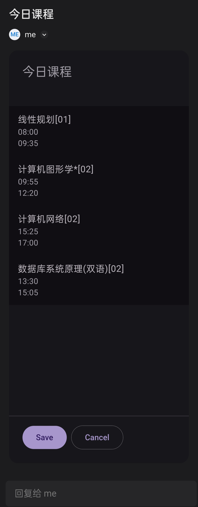

# classes reminder
Receive daily course reminders via email.

## quick start
1. Clone the repository
2. Install the requirements
```bash
go get .
```
3. Set your configuration

- Example file: `config_example.yaml`

4. Run the program
```bash
go run .
```

## screnshots


## LICENSE
[MIT](LICENSE)